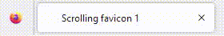

# favicon-marquee




> A class with no dependencies that adds an animated scrolling
> favicon to your website.
> See the [demo](https://laane.xyz/favicon/example1.html).

## Install

You can either [download](https://github.com/StenAL/favicon-marquee/archive/master.zip)
the whole project or install it via npm or yarn:

```sh
$ npm install favicon-marquee
$ yarn add favicon-marquee
```

## Use

favicon-marquee can be imported using ESM syntax

```js
import FaviconMarquee from "favicon-marquee";
```

or loaded from a CDN and used in a HTML module script

```html
<script type="module">
    import FaviconMarquee from "https://cdn.jsdelivr.net/npm/favicon-marquee/lib/main.js";
    // ...
</script>
```

Now that FaviconMarquee is in scope, you can use it by running the following code

```js
const marquee = new FaviconMarquee({
    text: "easy!",
    font: '"Comic Sans MS", sans-serif',
});
marquee.start();
```

This will start the marquee in your current tab with the text `easy!`.

FaviconMarquee can be customized by passing the following the properties
to its constructor, though sensible defaults are provided:

- `text` - text to be displayed in the favicon. This can be any unicode characters
  including emojis, cyrillic, hangul, etc.
- `font` - font of the text. This can be any valid CSS `font-family` value
- `fontSize` - size of the text to display. The canvas the text is painted to is 256x256,
  this value should be set with that size in mind
- `color` - color of the text to be displayed. Can be any valid CSS `color` value
- `background` - color of the marquee's background. Transparent by default. Can be
  any valid CSS `color` value
- `step` - specifies how many pixels the marquee scrolls each render. This can be used
  to speed up or slow down the text's scrolling
- `marginBottom` - the text is rendered at the bottom of the favicon. This option
  can be used to add some margin to the bottom to center the text instead
- `background` - the background color of the text. Can be any valid CSS `color` value.

These properties must be wrapped in an object before passing them to the constructor.

Additionally, a number can be passed into the `start` method to control how often (in ms) the
marquee is re-rendered.

```js
const marquee = new FaviconMarquee({
    text: "Some Text",
    color: "#323330",
    step: 1.5,
    fontSize: 32,
    background: "#F0DB4F",
    marginBottom: 5,
});
marquee.start();
```

`marquee.stop()` can be used to stop the marquee at any time, after which it can be restarted again with `marquee.start()`.

FaviconMarquee uses [progressive enhancement](https://en.wikipedia.org/wiki/Progressive_enhancement) to run more
efficiently in newer browsers. By default, the favicon is rendered on an HTML canvas. If the
browser supports [OffscreenCanvas](https://developer.mozilla.org/en-US/docs/Web/API/OffscreenCanvas), the favicon is
rendered on it instead, decoupling rendering from the DOM and increasing performance. Further, the OffscreenCanvas is rendered
using a [web worker](https://developer.mozilla.org/en-US/docs/Web/API/Web_Workers_API) which runs in a background thread
separate from the main thread, meaning that calculations do not block the browser's UI rendering.

## Contributing and Issues

Contributions are always welcome. Anyone can open issues and
pull requests on [GitHub](https://github.com/StenAL/favicon-marquee)

## License

This project is licensed under the [MIT license](https://github.com/StenAL/favicon-marquee/blob/master/LICENSE)
